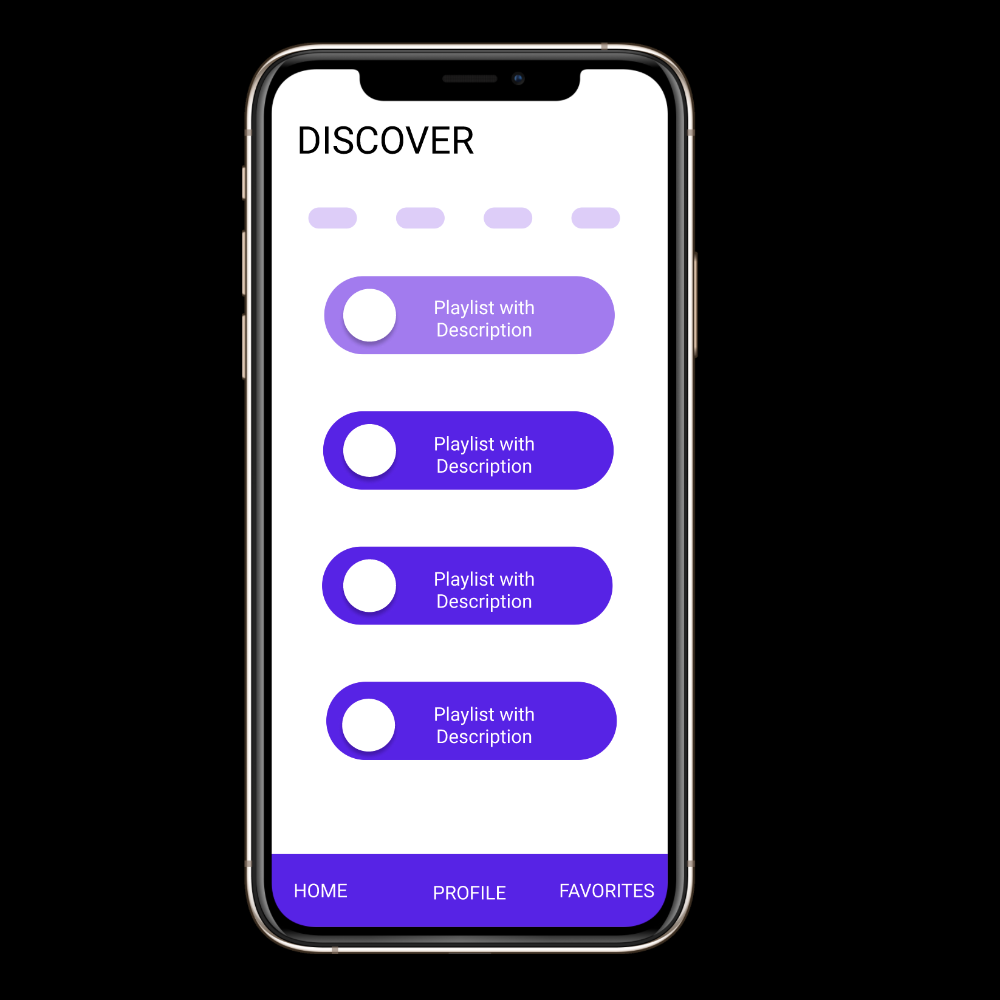

# Welcome to Aux Share

# Deployed Project

You can find the final project deployed to Heroku [here](https://aux-share-client.herokuapp.com/).

# About Aux Share

What started out as an idea to transfer playlists between Spotify and Apple music quickly morphed into an app to create and share mixtapes with a bit of analog flavor. To use the app, navigate to the deployed project, sign up for an account, start creating mixes, and enjoy the existing mixes created by other users. 

Create a mix, pass the aux. 

This application was Styled using [MlUI](https://mui.com/). The repository for the server of this app can be found [here](https://github.com/laurenashdurr/AuxShareServer).